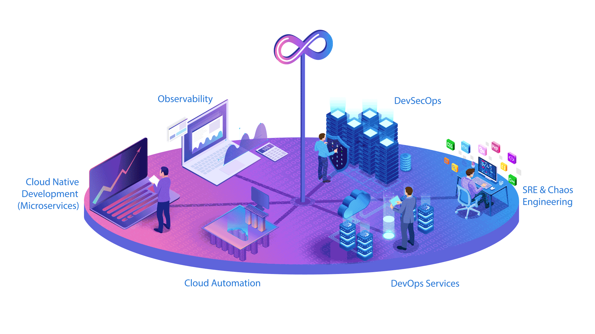
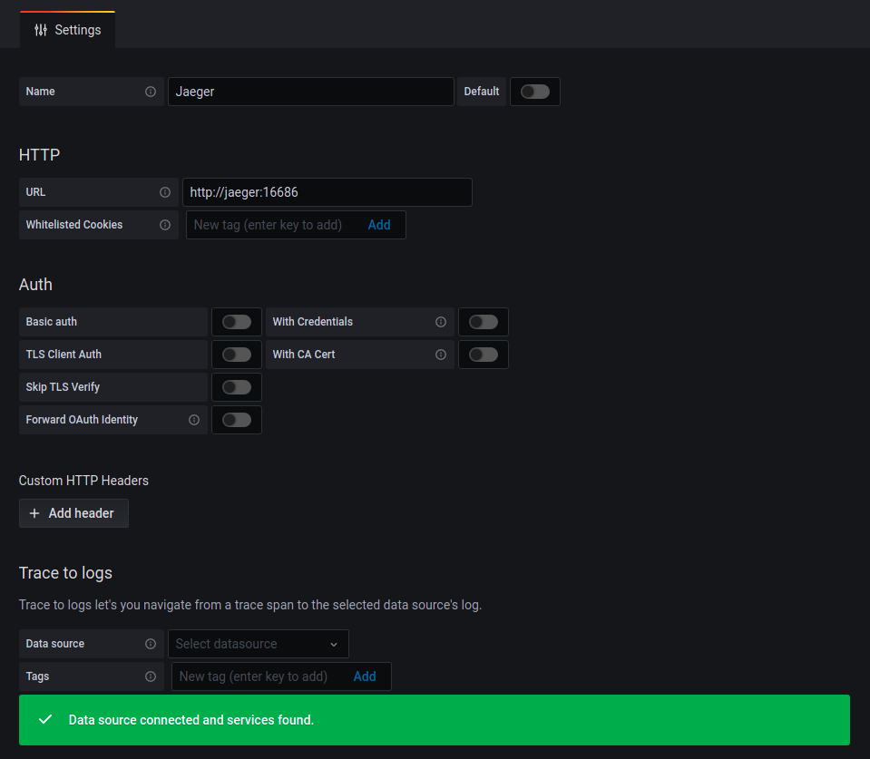
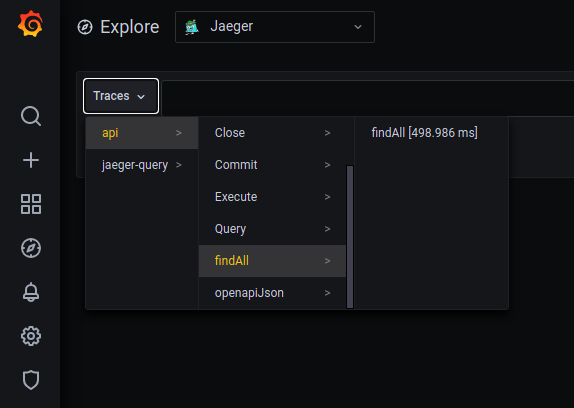
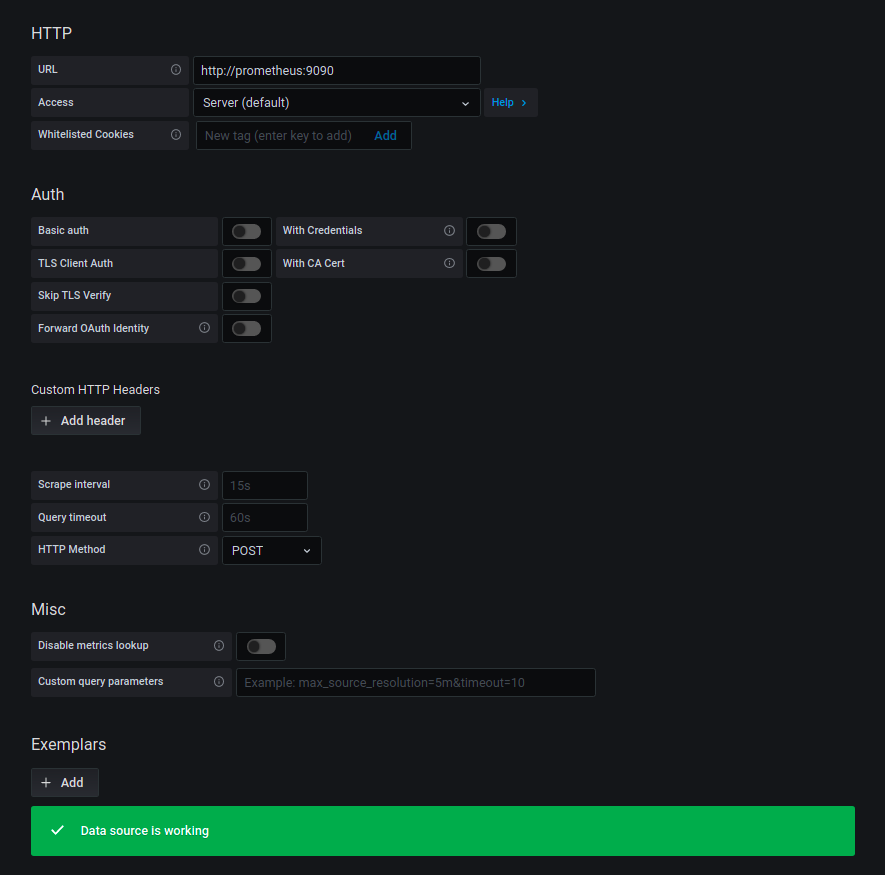
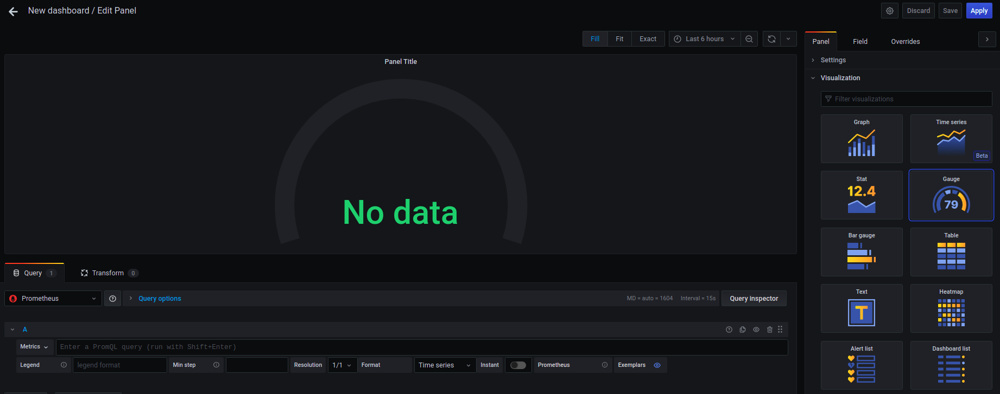
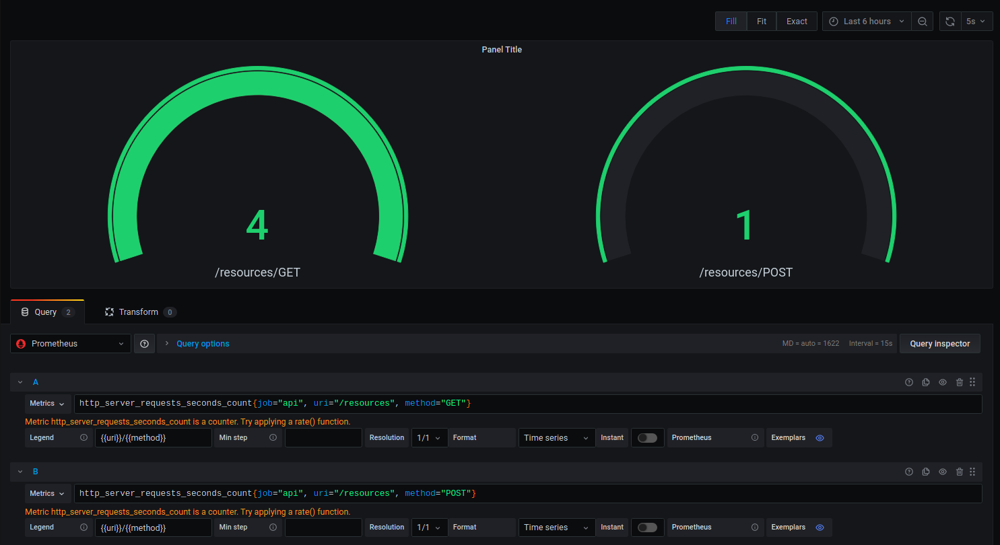
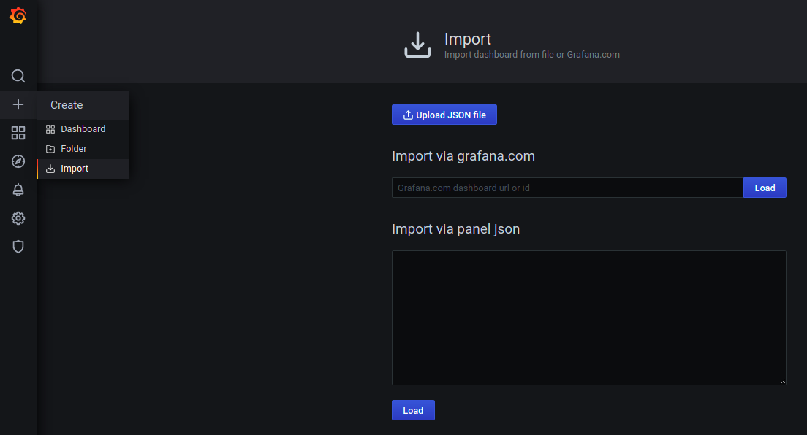
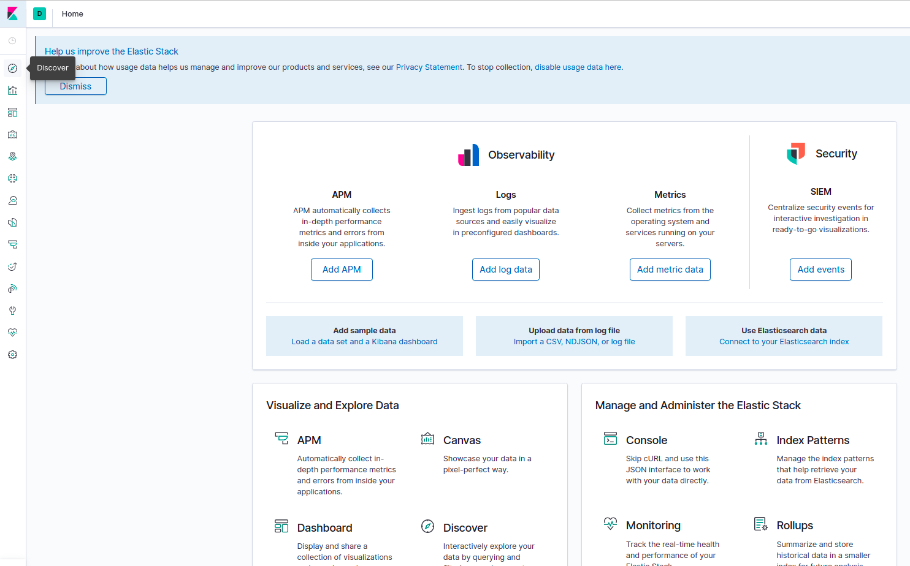
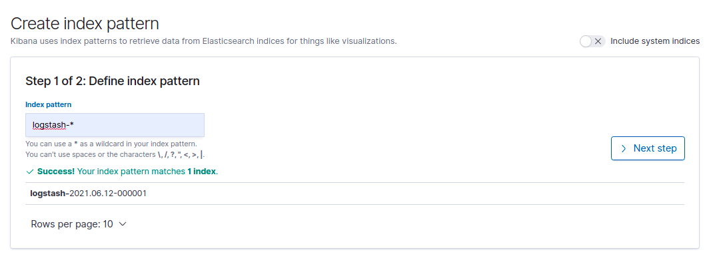
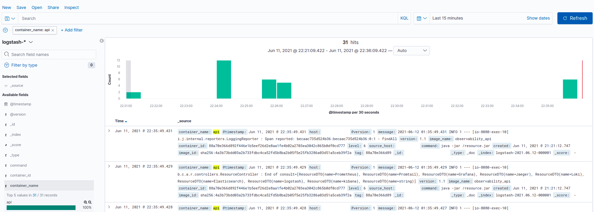

<h1 align="center"><span style="color:red; font-size:150%">Ferramentas de Observabilidade</span></h1>

#### <span style="font-size:130%">*Por [Lilian Sousa](https://www.linkedin.com/in/lilian-sousa/)*
#### <span style="font-weight: normal; font-size:150%">Conteúdo com objetivo de demonstrar configurações mínimas e uso prático de ferramentas de Observabilidade com base em estudos de diversas fontes</span>


## <span style="color:blue">Ferramentas utilizadas</span>
- ### Prometheus
        Monitoramento e alertas
- ### Promtail
        Agente de leitura de logs
- ### Grafana
        Análise e Monitoramento
- ### Loki
        Agregação de Registros
- ### Jaeger
        Tracing Distribuído
- ### Elasticsearch
        Busca e análise de dados
- ### Logstash
        Pipeline de dados
- ### Kibana
        Visualização de dados

## <span style="color:blue">Repositórios indicados</span>
- #### https://github.com/thbrunzendorf/monitoring-demo
- #### https://github.com/thukabjj/spring-boot-elasticsearch
- #### https://github.com/fabricioveronez/live-loki
- #### https://github.com/grafana/loki/blob/main/docs/sources/clients/promtail/configuration.md
- #### https://github.com/ivangfr/springboot-elk-prometheus-grafana
- #### https://github.com/opentracing-contrib/java-jdbc

## <span style="color:blue">Conteúdos indicados</span>
### Prometheus
- #### https://prometheus.io/docs/introduction/first_steps/
- #### https://medium.com/tech-grupozap/prometheus-monitorando-a-sa%C3%BAde-da-sua-aplica%C3%A7%C3%A3o-bd9b3b63e7b1

### Promtail + Loki
- #### https://www.youtube.com/watch?v=U_pLbS82iuA&t=2437s
- #### https://www.youtube.com/watch?v=lT4lKs9tu00&t=3585s
- #### https://medium.com/grafana-tutorials/logql-in-grafana-loki-ffc822a65f59 
- #### https://linuxblog.xyz/posts/grafana-loki/

### Jaeger
- #### https://www.redhat.com/pt-br/o-que-%C3%A9-jaeger#:~:text=Jaeger%20%C3%A9%20um%20software%20open,em%20ambientes%20de%20microsservi%C3%A7os%20complexos.

### ELK (Elasticsearch, Logstash, Kibana)
- #### https://medium.com/@davidcesc/elk-filebeat-for-container-logs-af71ce9cd53a

# <span style="color:red">Prometheus</span>
### https://prometheus.io/


### Releases
https://github.com/prometheus/prometheus/releases

### docker-compose
```
  prometheus:
    image: prom/prometheus:v2.26.0
    container_name: prometheus
    ports:
      - 9090:9090
    volumes:
      - ./prometheus.yml:/etc/prometheus/prometheus.yml
    command: --config.file=/etc/prometheus/prometheus.yml
    depends_on:
      - api
```

### prometheus.yml
```
global:
  scrape_interval: 15s

scrape_configs:
  - job_name: 'prometheus'
    scrape_interval: 5s
    static_configs:
      - targets: [ 'prometheus:9090' ]
  - job_name: 'api'
    scrape_interval: 5s
    metrics_path: 'actuator/prometheus'
    static_configs:
      - targets: [ 'api:8080' ]
```

### pom.xml
```
  <dependency>
      <groupId>io.micrometer</groupId>
      <artifactId>micrometer-registry-prometheus</artifactId>
      <version>${micrometer.version}</version>
  </dependency>
  <dependency>
      <groupId>org.springframework.boot</groupId>
      <artifactId>spring-boot-starter-actuator</artifactId>
  </dependency>
```

# <span style="color:red">Promtail</span>
### https://grafana.com/docs/loki/latest/clients/promtail/

### docker-compose
```
  promtail:
    image: grafana/promtail:2.0.0
    container_name: promtail
    volumes:
      - /var/lib/docker/containers:/var/lib/docker/containers
      - ./promtail:/etc/promtail-config/
    command:
      -config.file=/etc/promtail-config/promtail.yml
    depends_on:
      - api
```

### promtail.yml

```
server:
  http_listen_port: 9080
  grpc_listen_port: 0

positions:
  filename: /tmp/positions.yaml

clients:
  - url: http://loki:3100/loki/api/v1/push

scrape_configs:
  - job_name: containers
    static_configs:
      - targets:
          - localhost
        labels:
          job: containerlogs
          __path__: /var/lib/docker/containers/*/*log
```

# <span style="color:red">Grafana</span>
### https://grafana.com/


### Releases
https://github.com/grafana/grafana/releases

### docker-compose
```
  grafana:
    image: grafana/grafana:7.5.5-ubuntu
    container_name: grafana
    ports:
      - 3000:3000
    depends_on:
      - prometheus
```

# <span style="color:red">Loki</span>
### https://grafana.com/oss/loki/


### Releases
https://github.com/grafana/loki/releases

### docker-compose
```
  loki:
    image: grafana/loki:2.2.1
    container_name: loki
    ports:
      - 3100:3100
    command: -config.file=/etc/loki/local-config.yaml
```

# <span style="color:red">Jaeger<span>
### https://www.jaegertracing.io/   


### Releases
https://github.com/jaegertracing/jaeger/releases

### properties

###### Datasource
- Observe que o Tracing foi adicionado ao *driverClassName* para rastreamento das instruções SQL
```
spring.h2.console.enabled=true
spring.datasource.url=jdbc:tracing:h2:mem:resource
spring.datasource.driverClassName=io.opentracing.contrib.jdbc.TracingDriver
spring.datasource.username=resource
spring.datasource.password=
spring.jpa.show-sql=true
spring.jpa.database-platform=org.hibernate.dialect.H2Dialect
```

- Agrupa tracings por endpoint
    - opentracing.jaeger.sampler-type=const
    - opentracing.jaeger.sampler-param=1

###### Jaeger
```
opentracing.jaeger.service-name=api
opentracing.jaeger.udp-sender.host=jaeger
opentracing.jaeger.udp-sender.port=6831
opentracing.jaeger.sampler-type=const
opentracing.jaeger.sampler-param=1
```

### docker-compose
```
  jaeger:
    image: jaegertracing/all-in-one:1.22
    container_name: jaeger
    ports:
      - 5775:5775/udp
      - 6831:6831/udp
      - 6832:6832/udp
      - 5778:5778
      - 16686:16686
      - 14268:14268
      - 14250:14250
    depends_on:
      - api
```

### pom.xml
```
  <dependency>
      <groupId>io.opentracing.contrib</groupId>
      <artifactId>opentracing-spring-jaeger-web-starter</artifactId>
      <version>3.2.2</version>
  </dependency>
  <dependency>
      <groupId>io.opentracing.contrib</groupId>
      <artifactId>opentracing-jdbc</artifactId>
      <version>0.2.12</version>
  </dependency>
```

# <span style="color:red">ELK (Elasticsearch, Logstash, Kibana)</span>
### https://www.elastic.co/pt/what-is/elk-stack


### Releases
https://github.com/elastic/elasticsearch/releases   
https://github.com/elastic/logstash/releases    
https://github.com/elastic/kibana/releases

### docker-compose
```
  elasticsearch:
    image: docker.elastic.co/elasticsearch/elasticsearch:7.6.2
    container_name: elasticsearch
    environment:
      - discovery.type=single-node
    ports:
      - 9200:9200

  logstash:
    image: docker.elastic.co/logstash/logstash:7.6.2
    container_name: logstash
    links:
      - elasticsearch
    volumes:
      - ./logstash:/etc/logstash
    command: logstash -f /etc/logstash/logstash.conf
    ports:
      - 12201:12201/udp
    depends_on:
      - elasticsearch

  kibana:
    image: docker.elastic.co/kibana/kibana:7.6.2
    container_name: kibana
    ports:
      - 5601:5601
    depends_on:
      - elasticsearch
      - logstash
    logging:
      driver: gelf
      options:
        gelf-address: udp://localhost:12201
```

### logstash.conf
```
input {
  gelf {
    port => 12201
  }
}
output {
  stdout {}
  elasticsearch {
    hosts => ["http://elasticsearch:9200"]
  }
}
```

# <span style="color:blue">Configurando e Acessando Ferramentas</span>

### Subindo serviços e validando funcionamento

#### Obs.: todos os comandos deverão ser executados na raiz do projeto.

- Para uso do Loki, adicione o plugin abaixo:
- #### docker plugin install grafana/loki-docker-driver:2.2.1 --alias loki --grant-all-permissions

Startar os serviços:
- #### docker-compose up

Visualizar se todos serviços foram startados corretamente:
- #### docker-compose ps
Você visualizará algo similar:


Para visualizar log de container específico digite:
- #### docker-compose logs name-container

Se desejar parar os serviços e remover os containers digite:
- #### docker-compose down

## <span style="color:green">Swagger</span>
- Você poderá acessar o Swagger da aplicação através do endereço local:

    ### http://localhost:8080/swagger-ui.html


## <span style="color:green">Prometheus</span>
- É possível acessar a URL do Prometheus, através do endereço abaixo:
    ### http://localhost:9090

- Na página inicial é possível visualizar os endpoints disponibilizados pelo *Actuator*


- Selecione no *menu superior* a opção *Status* -> *Targets* para visualizar o status do serviço


## <span style="color:green">Grafana</span>
- Acesse o endereço abaixo e utilize senha e usuário padrão:
  ### http://localhost:3000/login

#### username: admin
#### password: admin
#### Obs.: após, redefina para um usuário e senha desejado.


- Você visualizará uma interface similar a esta:


### Criando Data Sources
- Clique em *DATA SOURCES*
- Obs.: adiante veremos também sobre os *DASHBOARDS*

### Data source Loki
- Vamos adicionar o data source do Loki, para isto realize a pesquisa por nome ou identifique-o na lista de ferramentas disponíveis:


- Observe que no campo *URL* informamos o nome correspondente ao serviço no *docker-compose* e porta padrão
- Clique em *Save & Test* e valide a conexão
- Será apresentada a mensagem abaixo indicando que a conexão foi criada com sucesso
```
Data source connected and labels found.
```


### Data source Jaeger
- Volte ao *Add data source*
- Os passos são similares as configurações do Loki


- Clique em *Save & Test* e valide a conexão
```
Data source connected and labels found.
```


### Visualizando Logs (Loki)
- No menu lateral clique na opção *Explore*


- Clique em *Log Browser*
- Você visualizará, através de *filename*, o id dos containers
- Para identificar qual é o container correspondente a aplicação, em um terminal, digite o comando *docker ps*
- O *container-name* da aplicação será *api*


- Selecione o *filename* correspondente ao container e clique em *Show logs*
- Você visualizará os logs da aplicação
- Para testar, faça uma requisição via Swagger e após clique em *Run query* na parte superior


### Traces (Jaeger)
- Faça uma requisição em um dos endpoints do *Swagger*
- Selecione o *Jaeger* na opção *Explore*
- Clique em *Traces* -> *api* -> *método* correspondente a execução



- Será possível identificar o Tracing da requisição executada
- Navegue na aba *Service & Operation*


- Também é possível acessar o *Jaeger* através do endereço local
    ### http://localhost:16686
- Na opção *Service* selecione *api*
- Clique em *Find Traces*
- A partir daí será possível identificar os *traces* da aplicação


### Data Source Prometheus
- A conexão é similar ao que vimos anteriormente




### Dashboard Prometheus
- Na página inicial do *Grafana* clique em *DASHBOARDS*
- Na página seguinte clique em *Add an empty panel*
- Selecione *Prometheus* na opção *Query* logo abaixo ao *Panel Title*
- Vamos trabalhar com a opção *Gauge* para visualização de métricas, então selecione a opção correspondente em *Panel* -> *Visualization*



- Em *Metrics* no painel *Query* estão disponíveis os endpoints fornecidos pelo Prometheus
- Neste momento vamos trabalhar com as seguintes queries:
- #### http_server_requests_seconds_count{job="api", uri="/resources", method="GET"}
- #### http_server_requests_seconds_count{job="api", uri="/resources", method="POST"}
- Note que também é possível formatar a legenda para visualização no campo *Legend*
- #### {{uri}}/{{method}}
- É possível parametrizar o tempo de atualização das informações com a opção *Refresh dashboard* -> *tempo* localizada no canto superior direito acima de *Panel Title*



### JVM (Micrometer)
- Nesta seção vamos adicionar o template do *Micrometer* ao *Grafana*
- Acesso o endereço abaixo:
    #### https://grafana.com/grafana/dashboards/4701
- É possível identificar, através da informação *Get this dashboard* que o *id* correspondente ao *dashboard* é o *4701*
- No menu lateral esquerdo do *Grafana* selecione a opção *Create* -> *Import*



- No campo *Load* digite o *id* correspondente ao template do *dashboard*: *4701* e clique em *Load*
- Após selecione o *Data source* correspondente ao *Prometheus* e cliente em *Import*
- Após, será possível a visualização do *dashboard JVM (Micrometer)*


## <span style="color:green">Kibana</span>
- Acesse o endereço abaixo:
    ### http://localhost:5601

- Selecione a opção *Discover* no menu lateral esquerdo ou em *Visualize and Explore Data*



- Crie o *index pattern* *logstash-** e clique em *Next step*


- No próximo step selecione *@timestamp* e clique em *Create index pattern*

  
- Volte para a página inicial e clique novamente em *Discover*
- Neste momento já será possível visualizar os logs da aplicação
- Neste exemplo estamos utilizando o *GELF* para captura de logs
  ### GELF Driver (Enviando Logs de Container para ELK)
  #### https://medium.com/@ridwanfajar/send-your-container-logs-to-elk-elasticsearch-logstash-and-kibana-with-gelf-driver-7995714fbbad

